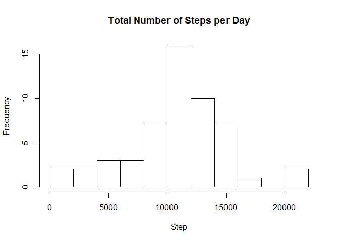
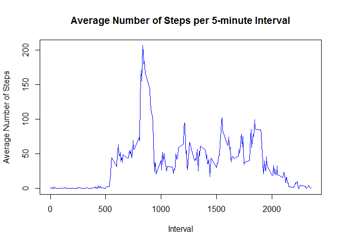
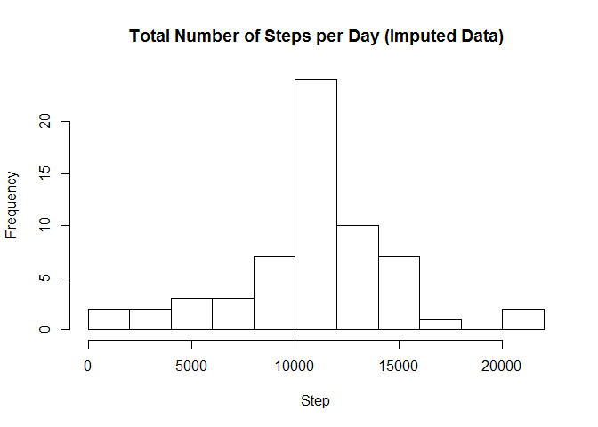
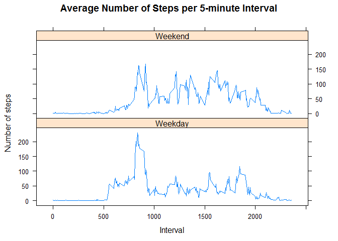

## Step 1: Loading and preprocessing the data
#### Check if `activity.csv` exists. If not, unzip the file to create it.

```r
file <- "activity.csv"
if (!file.exists(file)) {
    unzip("activity.zip", file)  
}
```
#### Load the data to `activity` and display the internal structure of it.

```r
activity <- read.csv(file, header = T)
str(activity)
```

```
## 'data.frame':	17568 obs. of  3 variables:
##  $ steps   : int  NA NA NA NA NA NA NA NA NA NA ...
##  $ date    : Factor w/ 61 levels "2012-10-01","2012-10-02",..: 1 1 1 1 1 1 1 1 1 1 ...
##  $ interval: int  0 5 10 15 20 25 30 35 40 45 ...
```
#### Change `date` from a factor variable to a Date variable.

```r
activity$date <- as.Date(activity$date)
```

## Step 2: Histogram of total number of steps taken each day
#### Calculate the total number of steps taken per day.

```r
steps_by_date <- aggregate(steps ~ date, data = activity, FUN = sum, na.rm = T)
head(steps_by_date)
```

```
##         date steps
## 1 2012-10-02   126
## 2 2012-10-03 11352
## 3 2012-10-04 12116
## 4 2012-10-05 13294
## 5 2012-10-06 15420
## 6 2012-10-07 11015
```
#### Make a histogram.

```r
hist(steps_by_date$steps, breaks = 10, xlab = "Step", main = "Total Number of Steps per Day")
```

<!-- -->

## Step 3: Mean and median number of steps taken each day

```r
mean_steps <- mean(steps_by_date$steps)
round(mean_steps)
```

```
## [1] 10766
```

```r
median_steps <- median(steps_by_date$steps)
round(median_steps)
```

```
## [1] 10765
```
#### Therefore, the mean and median of the total number of steps taken per day are 10766 and 10765 respectively.

## Step 4: Time series plot of average number of steps
#### Make a time series plot of the 5-minute interval (x-axis) and the average number of steps taken, averaged across all days (y-axis).

```r
steps_by_int <- aggregate(steps ~ interval, data = activity, FUN = mean, na.rm = T)
head(steps_by_int)
```

```
##   interval     steps
## 1        0 1.7169811
## 2        5 0.3396226
## 3       10 0.1320755
## 4       15 0.1509434
## 5       20 0.0754717
## 6       25 2.0943396
```

```r
plot(steps_by_int$interval, steps_by_int$steps, type = "l", 
     col = "blue", xlab = "Interval", ylab = "Average Number of Steps",
     main = "Average Number of Steps per 5-minute Interval")
```

<!-- -->

## Step 5: The 5-minute interval that contains the maximum number of steps on average

```r
steps_by_int[which.max(steps_by_int$steps), 1]
```

```
## [1] 835
```

## Step 6: Imputing missing data 
#### `misind` is a vector of indicators of missing value.

```r
misind <- is.na(activity$steps)
sum(misind)
```

```
## [1] 2304
```
#### Therefore, the total number of missing values in the dataset is 2304. Then calculate the mean for each 5-minute interval and fill in all of the missing values in the dataset by the mean.

```r
avg_int <- tapply(activity$steps, activity$interval, mean, na.rm = T)
head(avg_int)
```

```
##         0         5        10        15        20        25 
## 1.7169811 0.3396226 0.1320755 0.1509434 0.0754717 2.0943396
```

#### Create a new dataset `activity_clean` that is equal to the original dataset but with the missing data filled in.

```r
activity_clean <- activity
activity_clean$steps[misind] <- avg_int[as.character(activity$interval[misind])]
head(activity_clean)
```

```
##       steps       date interval
## 1 1.7169811 2012-10-01        0
## 2 0.3396226 2012-10-01        5
## 3 0.1320755 2012-10-01       10
## 4 0.1509434 2012-10-01       15
## 5 0.0754717 2012-10-01       20
## 6 2.0943396 2012-10-01       25
```

```r
sum(is.na(activity_clean$steps))
```

```
## [1] 0
```
#### Therefore, there are no more missing values in `activity_clean`. Then calculate the mean and median number of steps taken per day (for imputed data).

```r
clean_steps_by_date <- aggregate(steps ~ date, data = activity_clean, FUN = sum, na.rm = T)
mean_clean_steps <- mean(clean_steps_by_date$steps)
round(mean_clean_steps)
```

```
## [1] 10766
```

```r
median_clean_steps <- median(clean_steps_by_date$steps)
round(median_clean_steps)
```

```
## [1] 10766
```
#### Therefore, the mean and median of the total number of steps taken per day (for imputed data) are 10766 and 10766 respectively. These values do not differ much from the estimates from the first part of the assignment. The impact of imputing missing data on the estimates of the total daily number of steps is that it can introduce bias.

## Step 7: Histogram of total number of steps taken each day after missing values are imputed

```r
clean_steps_by_date <- aggregate(steps ~ date, data = activity_clean, FUN = sum, na.rm = T)
head(clean_steps_by_date)
```

```
##         date    steps
## 1 2012-10-01 10766.19
## 2 2012-10-02   126.00
## 3 2012-10-03 11352.00
## 4 2012-10-04 12116.00
## 5 2012-10-05 13294.00
## 6 2012-10-06 15420.00
```

```r
hist(clean_steps_by_date$steps, breaks = 10, xlab = "Step", 
     main = "Total Number of Steps per Day (Imputed Data)")
```

<!-- -->

## Step 8: Comparing average number of steps taken per 5-minute interval across weekdays and weekends
#### Create a new factor variable in the dataset with two levels ¡V ¡§weekday¡¨ and ¡§weekend¡¨ indicating whether a given date is a weekday or weekend day.

```r
library(lattice)
weektype <- weekdays(activity_clean$date)
activity_clean$weektype <- ifelse(weektype == "Saturday" | weektype == "Sunday", "Weekend", "Weekday")
activity_clean$weektype <- as.factor(activity_clean$weektype)
head(activity_clean)
```

```
##       steps       date interval weektype
## 1 1.7169811 2012-10-01        0  Weekday
## 2 0.3396226 2012-10-01        5  Weekday
## 3 0.1320755 2012-10-01       10  Weekday
## 4 0.1509434 2012-10-01       15  Weekday
## 5 0.0754717 2012-10-01       20  Weekday
## 6 2.0943396 2012-10-01       25  Weekday
```
#### Calculate the average number of steps taken across all weekday days or weekend days.

```r
clean_steps_by_int <- aggregate(steps ~ interval + weektype, data = activity_clean, FUN = mean, na.rm = T)
head(clean_steps_by_int)
```

```
##   interval weektype      steps
## 1        0  Weekday 2.25115304
## 2        5  Weekday 0.44528302
## 3       10  Weekday 0.17316562
## 4       15  Weekday 0.19790356
## 5       20  Weekday 0.09895178
## 6       25  Weekday 1.59035639
```
#### Make a panel plot containing a time series plot of the 5-minute interval (x-axis) and the average number of steps taken, averaged across all weekday days or weekend days (y-axis).

```r
xyplot(steps ~ interval | weektype, data = clean_steps_by_int, type = "l",  layout = c(1,2), 
       main = "Average Number of Steps per 5-minute Interval", ylab = "Number of steps", xlab = "Interval")
```

<!-- -->

#### Therefore, there are differences in activity patterns between weekdays and weekends.
